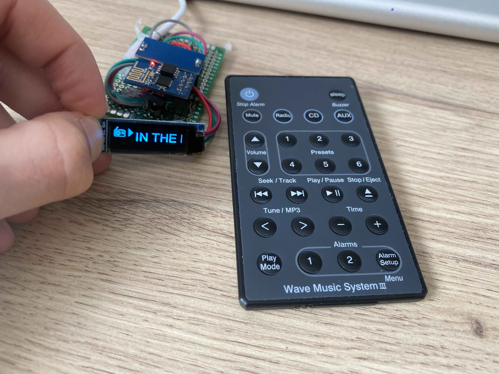

#SoundTouch IR

Simple IR receiver for SoundTouch systems that don't have an IR remote, e.g. the SoundTouch Wireless Link Adaptor or SA-5 Amplifier.



Based on the ESP8266, this project uses the SoundTouch API to control the SoundTouch device and retrieve playback information over WiFi.

I've bought a cheap clone of the Wave Music System Remote over eBay and taught the IR codes of that remote to my ESP8266. Information about what's currently playing is displayed on a SSD1306 based OLED display with 128x32 pixel resolution (high resolutions would require adjustments in the code).

##Requirements
You'll need the following libraries to get it running:

* `IRremoteESP8266` to decode the IR signals
* `ESP8266_and_ESP32_Oled_Driver_for_SSD1306_display` for the screen
* `arduinoWebSockets` for communication with the SoundTouch device

In order to connect to your WiFi and SoundTouch device, you'll need to create the a `co
nfig/Config.hpp` file with this content:

```c++
#pragma once
//---------------------------------------------------------------------
namespace config {
//---------------------------------------------------------------------
/// WIFI
constexpr char ssid[] = /*Your WiFi SSID*/;
constexpr char password[] = /*Your WiFi Password*/;
//---------------------------------------------------------------------
/// The name of this ESP device to be used for the mDNS
constexpr char mDNSName[] = /*mDNS name of your choice you'd like to see*/; 
/// The URL of the SoundTouch device to use.
constexpr char deviceURL[] =  /*IP Address of SoundTouch device*/;
//---------------------------------------------------------------------
}
```